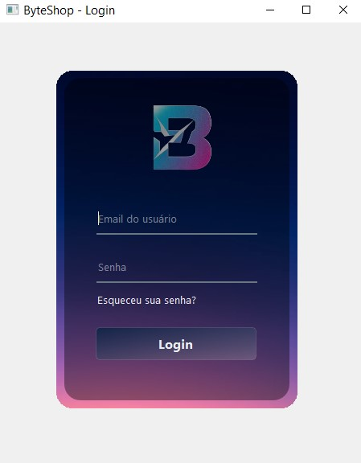
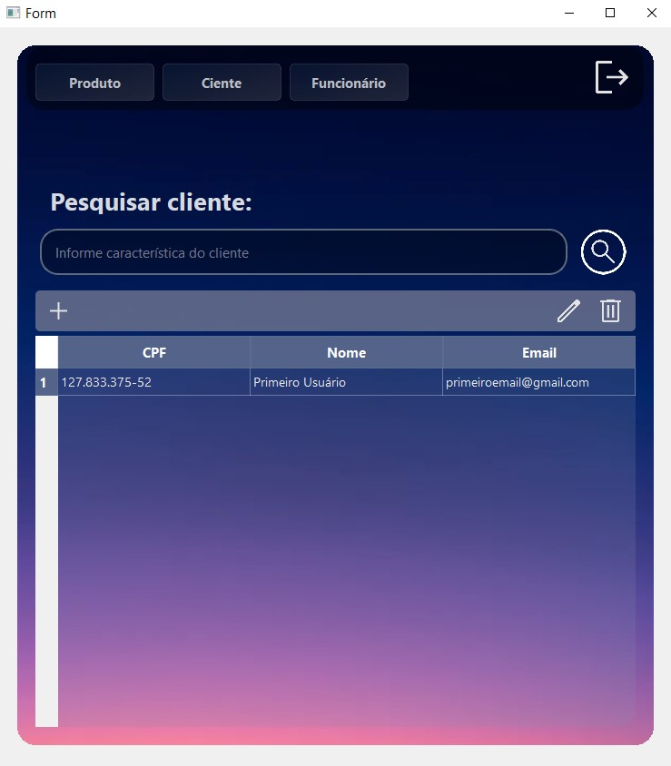
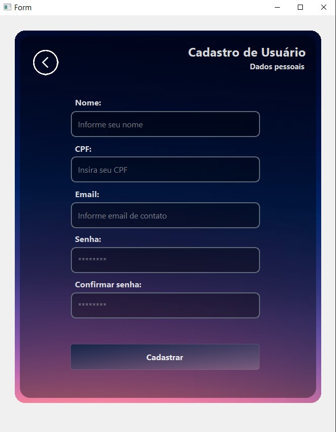

# Byteshop: Loja fictícia de peças eletrônicas


[](https://github.com/Vogi-png/byteshop-software/releases)
###


<br/>

## 📸 Screenshots

<table align="center">
  <tr>
    <td align="center"><strong>Tela de Login</strong></td>
    <td align="center"><strong>Menu Principal</strong></td>
  </tr>
  <tr>
    <td></td>
    <td></td>
  </tr>
  <tr>
    <td align="center"><strong>Tabela de Cliente</strong></td>
    <td align="center"><strong>Cadastro de Cliente</strong></td>
  </tr>
  <tr>
    <td></td>
    <td></td>
  </tr>
</table>


> Este é o repositório do **ByteShop**, um software desenvolvido para uma loja fictícia com o objetivo de gerenciar sua produção e suas operações. O sistema foi criado em Python, com uma interface gráfica projetada no Qt Designer e conectada através da biblioteca PySide6 (ou PyQt).
---

## ✨ Funcionalidades Principais

* 🔐 **Autenticação Segura:** Tela de login para garantir que apenas usuários autorizados acessem o sistema.
* 💻 **Gerenciamento:** Cadastro, edição, exclusão e consulta.
* 🔍 **Busca Inteligente:** Ferramenta de pesquisa em todas as seções para encontrar registros rapidamente.

---

<br/>

## 🛠️ Ajustes e melhorias

O projeto ainda está em desenvolvimento e as próximas atualizações serão voltadas para as seguintes tarefas:
### Curto Prazo
- [ ] **Implementar Dashboard de Rendimentos:** Criar uma interface gráfica para que o administrador possa visualizar as métricas de vendas e o faturamento em diferentes períodos (diário, mensal, anual).
- [ ] **Melhorar a Gestão do Banco de Dados:** Implementar um sistema de *migrations* para automatizar e versionar as alterações no esquema do banco de dados, facilitando a instalação e atualização para novos colaboradores.
- [ ] **Refatoração do Código:** Otimizar a estrutura atual do código para melhorar a legibilidade, performance e facilitar a manutenção futura.

### Médio/Longo Prazo
- [ ] **Empacotamento da Aplicação:** Criar um instalador/executável (`.exe` para Windows) para que o sistema possa ser facilmente instalado e utilizado sem a necessidade de ter o Python e as bibliotecas instaladas.
- [ ] **Adicionar Testes Automatizados:** Desenvolver testes unitários e de integração para garantir a estabilidade do sistema e evitar regressões.
---

<br/>

## 💻 Pré-requisitos

Antes de começar, verifique se você atendeu aos seguintes requisitos:

- Python 3.8+

- MySQL Server (recomendado versão 8.x)

- Git

- Pip (gerenciador de pacotes do Python)

Bibliotecas Python necessárias:

- PySide6 (interface gráfica)

- mysql-connector-python (conexão com MySQL)
  
---

<br/>

## 🚀 Instalando Bytecode

Para instalar o Bytecode, siga estas etapas:

### 1. Clonar o Repositório
Abra seu terminal ou Git Bash e execute o seguinte comando para baixar o projeto:
```
git clone https://github.com/Vogi-png/byteshop-software.git
```

---

<br/>

## ☕ Usando Byteshop

Para usar o sitema da empresa fictícia, siga estas etapas:

- Passo 1: Modificando Senha.
###
Edite os arquivos ```conexoes.py``` e ```database_setup.py```, substituindo a senha do banco pela senha que você colocou no seu banco de dados na maquina local.
###
- Passo 2: Criando o Banco de dados.
```
python database_setup.py
```
###
- Passo 3: Iniciando o Sistema
```
python src/main.py
```
---

<br/>

## 🤝 Colaboradores

Agradecemos às seguintes pessoas que contribuíram para este projeto:

<table>
  <tr>
    <td align="center">
      <br>
      <sub>
        <b>Giovanna Leal de Araujo</b>
      </sub>
    </td>
    <td align="center">
      <br>
      <sub>
        <b>Guilherme Barreiros Pimentel</b>
      </sub>
    </td>
    <td align="center">
      <br>
      <sub>
        <b>João Pedro de Macedo Figueiredo</b>
      </sub>
    </td>
    <td align="center">
      <br>
      <sub>
        <b>João Vitor Gomes Santos</b>
      </sub>
    </td>
    <td align="center">
      <br>
      <sub>
        <b>Lorenzo Braiener da Cunha</b>
      </sub>
    </td>
    <td align="center">
      <br>
      <sub>
        <b>Maria Luiza França Mendes</b>
      </sub>
    </td>
    <td align="center">
      <br>
      <sub>
        <b>Raphael Bíssimos Costa Dos Santos</b>
      </sub>
    </td>
  </tr>
</table>

</table>
